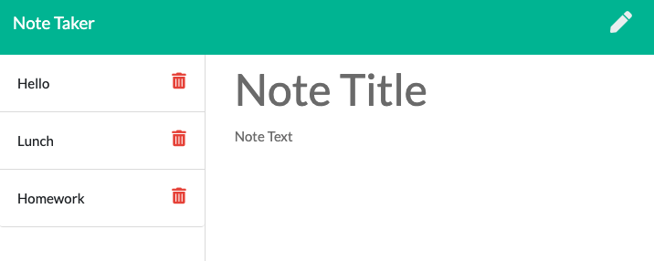

# Note Taker  
    
  ## Description  
  The Note Taker project provides a user with a handy interface to create, store, view and edit notes through a browser application.  
  ## Launched Application
    
  **[Link to Application](https://warm-caverns-34712.herokuapp.com/)**
  
  ## Table of Contents   
  [Installation](##Installation)  
  [Usage](##Usage)  
  [License](##License)  
  [Contributiing](##Contributing)  
  [Tests](##Tests)  
  [Questions](##Questions)
    
  ## Installation  
  No installation is required to use the Note Taker application in a browser. If desired, the application may be cloned from github in order to expand or modify the app. 
  Once cloned onto the user's machine, the required dependencies of "express" and "uuid" may be installed with the comand line `npm i`.   
  ## Usage  
  To use the application, navigate to the notes page by clicking the get started button on the landing page. Once at the notes page, a user may select a note to view the contents, or create a new note by selecting the pencil icon, and then save it to the notes list, by clicking the save button in the upper right corner.  
  ## License   
  This project is not licensed.    
  ## Contributing  
  There are no guidlines for contribution at this time.  
  ## Tests   
  There are no testing contributions at this time.  
  ## Questions  
  I can be reached at mcbrayer.ian@gmail.com for further information.  
  Please feel free to also check out my work at https://github.com/ihm57511
